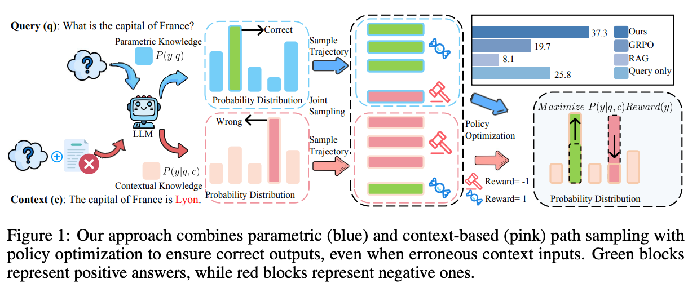

<div align="center">

# Resisting Contextual Interference in RAG via Parametric-Knowledge Reinforcement
[](https://arxiv.org/abs/2506.05154)  [](https://drive.google.com/file/d/1Z8f45da26dgfi0_IrKoO7t-wdrvdS0HL/view?usp=drive_link) 

</div>


## ⚡ Updates
* 05/06/2025: 🎉 We release our paper and codebase.
* 09/26/2025: 🎉 We update our paper and code.

## 🚀 Introduction
<p align="center">
  
</p>

**Knowledgeable-R1** is an effective strategy for the RL training of LLMs that using joint sampling and define multi policy distributions in knowledge capability exploration to stimulate large language models’ self-integrated utilization of parametric and contextual knowledge. Experiments show that Knowledgeable-R1 significantly improves robustness and reasoning accuracy in knowledge conflict scenarios and general RAG scenarios, outperforming SOTA baselines by 23\% in counterfactual scenarios, and without degradation when the retrieved context is fully accurate.

🎯 **Key Benefits**:
- **No additional cost** — only the rollout strategy and RL objective is modified 
- **Easy to adopt** — no additional components or complex multiple prompt pipelines are required in application  
- **Superior generalization** — Knowledgeable-r1 significantly enhances robustness and reasoning accuracy in both parameters and contextual conflict tasks and general RAG tasks


## 🙌 Environment
The runtime environment is in the requirements.txt
so you can
``` bash
conda create -n knowledgeable-r1 python=3.11 -y && conda activate knowledgeable-r1
pip install -r requirements.txt
```
## Usage
Download all dataset through [this link.](https://drive.google.com/file/d/1Z8f45da26dgfi0_IrKoO7t-wdrvdS0HL/view?usp=drive_link) 
Unzip it under the folder of knowledgeable-R1.

### Training
Run the following command:
### GRPO W/ RAG
``` bash
bash training_scripts/qwen2_5_7b_knowledge_confiqa_mc_grpo.sh 
```
### Ours
``` bash        
bash training_scripts/qwen2_5_7b_knowledge_confiqa_mc_knowledgeable_r1.sh
```
### Evaluation
``` bash
bash eval_query_only.sh     #for query only
bash eval_query_with_rag.sh #for RAG
bash eval_ours.sh
python get_metric.py
```
Our evaluation results can be found in [this link.](https://drive.google.com/file/d/1kFjOx5ESiACxayFhaoa0xWMadS5EwgC-/view?usp=drive_link)

🎯 **Key Benefits**:
- **No additional cost** — only the rollout strategy and RL objective is modified 
- **Easy to adopt** — no additional components or complex multiple prompt pipelines are required in application  
- **Superior generalization** — Knowledgeable-R1 significantly enhances robustness and reasoning accuracy in both parameters and contextual conflict tasks and general RAG tasks


## Citation
If you find our works useful for your research, please consider citing:
```bibtex
@misc{lin2025knowledgeabler1policyoptimizationknowledge,
      title={Knowledgeable-r1: Policy Optimization for Knowledge Exploration in Retrieval-Augmented Generation}, 
      author={Chenyu Lin and Yilin Wen and Du Su and Fei Sun and Muhan Chen and Chenfu Bao and Zhonghou Lv},
      year={2025},
      eprint={2506.05154},
      archivePrefix={arXiv},
      primaryClass={cs.CL},
      url={https://arxiv.org/abs/2506.05154}, 
}
```
## Acknowledgement
* The training codes are built on [EasyR1](https://github.com/hiyouga/EasyR1), and the evaluation suite employs [vLLM](https://github.com/vllm-project/vllm) for acceleration.
* The base models are from [Qwen2.5-7B-Instruct](https://huggingface.co/Qwen/Qwen2.5-7B-Instruct) and [Qwen2.5-3B-Instruct](https://huggingface.co/Qwen/Qwen2.5-3B-Instruct).
* The original training datasets are from [ConFiQA](https://github.com/byronBBL/Context-DPO) and [HotpotQA](http://curtis.ml.cmu.edu/datasets/hotpot/).
